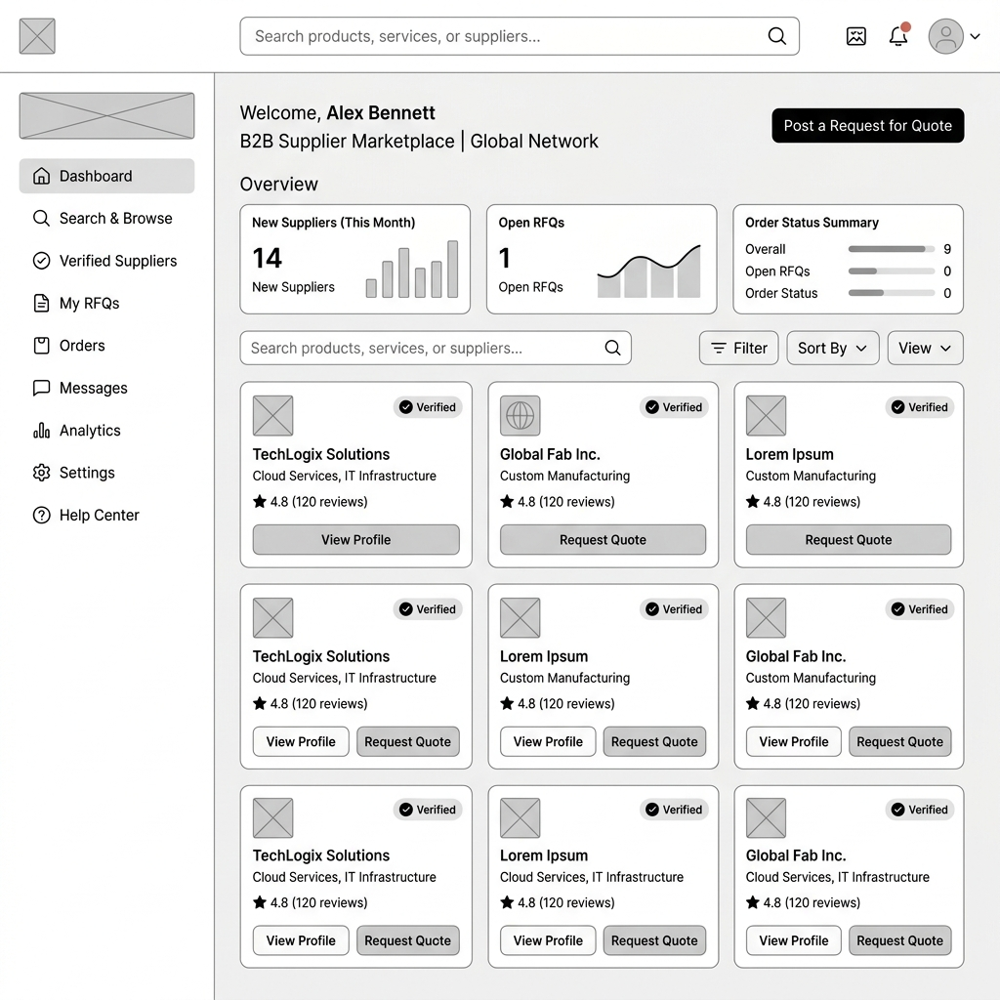
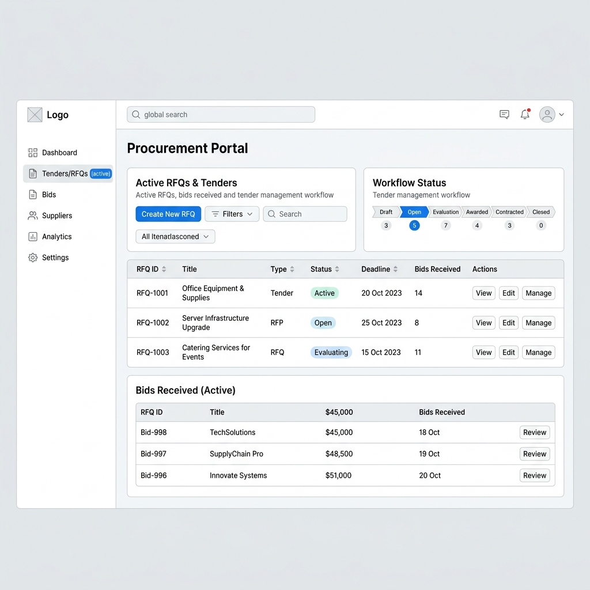

# Pula Trade v2 – Product Specification

## 1. Executive Summary
**Mission**: Create the leading procurement and supplier ecosystem in Africa, beginning with Botswana.
**Vision**: To serve as the digital infrastructure for procurement, supplier discovery, contract management, and business networking across the SADC region. Pula Trade v2 transitions entirely away from escrow services, focusing strictly on B2B matchmaking, verified discovery, and procurement workflow automation.

## 2. Target Users
*   **Enterprise & Corporate**: Mining companies, Construction firms, Government suppliers, Manufacturers, Logistics companies, Corporate procurement departments.
*   **SMEs**: Verified local suppliers seeking enterprise contracts.

## 3. Platform Architecture (Next.js + Supabase + Google Cloud)

Pula Trade v2 will utilize a modern, scalable Serverless SaaS architecture.

*   **Frontend**: Next.js (App Router), React, TypeScript, Tailwind CSS, Shadcn UI
*   **Backend as a Service (BaaS)**: Supabase (PostgreSQL, Auth, Edge Functions, Storage)
*   **AI Engine**: Featherless AI / Gemini for agent reasoning, Vector Search (pgvector) for matchmaking
*   **Cloud Infrastructure**: Google Cloud Platform (GCP) for Document Intelligence (OCR) and specialized AI microservices.

## 4. Database Schema (PostgreSQL via Supabase)

### Core Tables
*   `users`: UUID, email, full_name, role (admin, buyer, supplier), created_at, status.
*   `companies`: id, user_id, name, registration_number, tax_number, country, verified_status, industry.
*   `supplier_profiles`: company_id, portfolio_url, capabilities, certifications, risk_score, rating.
*   `products_services`: id, supplier_id, name, description, category, price_range.
*   `rfqs` (Request for Quotation): id, buyer_id, title, description, deadline, budget, status, required_certifications.
*   `bids`: id, rfq_id, supplier_id, proposal_text, price, submitted_at, status (pending, accepted, rejected).
*   `contracts`: id, bid_id, buyer_id, supplier_id, document_url, signed_at, status.

## 5. User Roles and Permissions

*   **System Admin**: Full access to analytics, user moderation, verification approvals, and billing.
*   **Enterprise Buyer**: Can create RFQs, view supplier risk scores, invite suppliers, manage tenders, access analytics dashboard, and generate contracts.
*   **Verified Supplier**: Can list products/services, submit bids to public RFQs, receive targeted invitations, upload compliance documents, and access basic performance metrics.

## 6. Enterprise Procurement Workflows

1.  **Requisition & RFQ Creation**: Buyer defines requirements, required certifications, and deadlines.
2.  **AI-Powered Supplier Discovery**: The AI Matchmaking agent queries the vector database to identify and recommend suppliers with matching capabilities and high trust scores.
3.  **Tender Broadcasting**: RFQ is sent to matching suppliers.
4.  **Bid Submission & Evaluation**: Suppliers submit proposals. Buyer reviews bids on a unified dashboard, aided by AI summaries and vendor risk scoring.
5.  **Contract Finalization**: Digital NDA execution, automated purchase agreement generation from templates, and electronic signature capture.
6.  **Fulfillment Tracking**: Purchase order issuance, delivery milestone tracking, and final approval workflow.

## 7. AI Agent Ecosystem

*   **Market Discovery Agent**: Scours regional databases and news for emerging suppliers and procurement trends.
*   **Supplier Intelligence Agent**: Analyzes supplier portfolios and compliance documents via OCR to extract capabilities and update vector embeddings.
*   **Verification & Risk Agent**: Cross-references tax numbers and registration details; assigns dynamic trust scores based on historical performance and data completeness.
*   **Matchmaking Agent**: Uses cosine similarity on user RFQ vectors and supplier capability vectors to provide highly accurate vendor recommendations.

## 8. Premium Features (Competitive Differentiators)

*   **Market Price Benchmarking**: AI analysis of historical and regional data to provide buyers with expected cost ranges for specific RFQs.
*   **Supplier Risk Intelligence**: Real-time alerts on supplier financial health or compliance expiration.
*   **Cross-Border SADC Trade Assistant**: Automated tariff calculations and compliance requirement checklists for regional trade.
*   **Dynamic Procurement Insights**: Predictive analytics suggesting when to buy certain materials based on market trends.

## 9. Monetization Strategy

*   **Supplier Subscriptions**: Freemium model. Basic listing is free. Premium gets higher search visibility, advanced analytics, and priority RFQ access.
*   **Verification Packages**: One-time or annual fees for expediting manual compliance checks and earning "Trust Badges".
*   **Enterprise Procurement Subscriptions**: SaaS tier for large buyers to access unlimited RFQs, custom workflow integrations, and advanced AI matching.
*   **RFQ Posting Fees**: Pay-per-tender model for non-subscribed buyers.

## 10. Roadmap: MVP to SADC Expansion

*   **Phase 1: MVP (Months 1-3)**
    *   Botswana focus.
    *   Core supplier directory and basic profile creation.
    *   Manual RFQ posting and bidding system.
    *   Basic Supabase integration (Auth, DB).
*   **Phase 2: AI & Workflow (Months 4-6)**
    *   Implementation of pgvector for AI Matchmaking.
    *   Document AI for automated compliance extraction.
    *   Contract management (e-signatures).
*   **Phase 3: Enterprise Features (Months 7-9)**
    *   Procurement Analytics Dashboard.
    *   Advanced Vendor Risk Scoring.
    *   API integrations for corporate ERPs.
*   **Phase 4: SADC Expansion (Months 10-12)**
    *   Multi-country compliance frameworks (South Africa, Namibia, Zambia).
    *   Cross-border logistics matching.
    *   Multi-currency display architecture.

---
*Generated by Antigravity / AI Product Architect*

## 11. Wireframes

### Supplier Marketplace

### Buyer Procurement Portal

